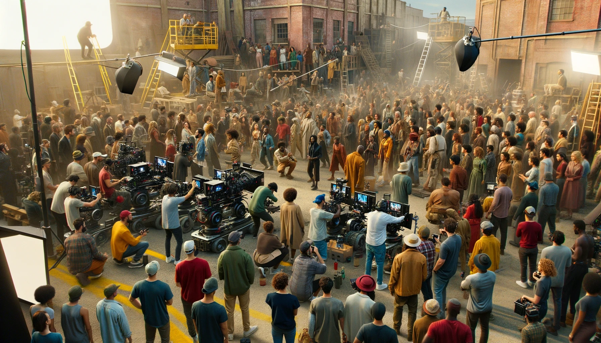
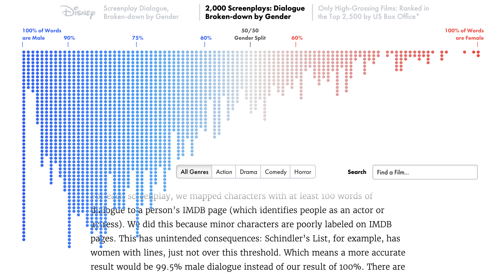
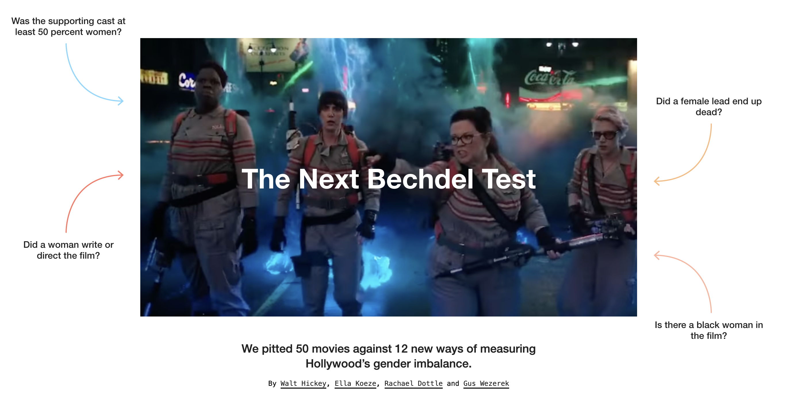
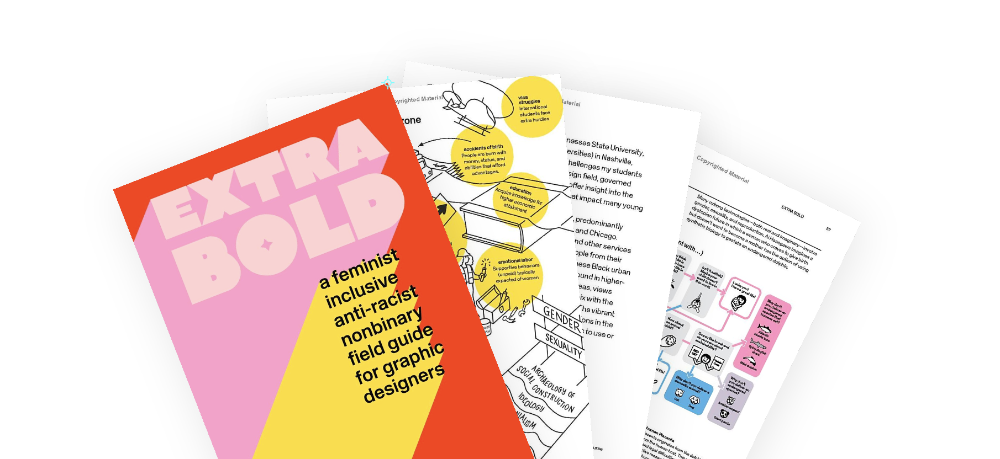

# EPS - Màster in Data Science UdG | Hackathon: Inclusivity in Cinema
 

This hackathon is a shared activity between the Project Management in Data Science and Data Visualization modules. The event is supported by the [ViT Foundation](https://www.fundaciovit.org/), the [Càtedra Lluís Santaló d'Aplicacions de la Matemàtica](http://www.udg.edu/es/catedres/Lluis-Santalo), and the [Càtedra d'Informació i Computació (Eurecat)](https://www.udg.edu/ca/catedres/informacio-i-computacio).

---

**Table of contents**
* [About the data](#about-the-data)
* [Some helpful tools and resources](#some-helpful-tools-and-resources)
* [Teams and objectives](#teams-and-objectives)
* [Day-of schedule](#day-of-schedule)
* [The awards](#the-awards)
* [Our valuation criteria](#our-evaluation-criteria)

---

**💡 Objective:**

To develop an **inclusivity index for movies** that evaluates diversity representation concerning race, gender, sexual orientation ... We'll start off with **IMDB data** and **Cornell's Movie Dialog Corpus**, aiming to provide insights into the inclusivity of cinema and how it reflects society.

**🔍 Tasks include:**

* Defining a new inclusivity index
* Recodifying characters' metadata to include race, sexual orientation ...
* Analyzing the marketability of inclusive cinema
* Applying the model to Academy Award best picture nominees
* Interactive explanatory notebook of the index results and its components
* Interactive visualization of the characters' metadata
* Visual analysis of box office revenue and inclusivity
* Visual analysis of the latest Academy Award nominees

**🧑‍🎓 What you will learn:**

- Advanced techniques in data science and visualization.
- Collaborative skills in a team setting.
- How to translate data insights into actionable visual stories.
- Understanding of inclusivity in the context of the film industry.

#### 📅 Pre-hackathon preparations:
Pre-hackathon prep is key to be efficient and effective during the event. It involves understanding the theme, organizing the team, brainstorming ideas, and setting up the necessary tools and environment in advance. This way you can focus on developing your project rather than dealing with logistical or technical issues.

- Familiarize with IMDB data and Cornell's Movie Dialog Corpus —including understanding each variables and doing any data cleanup required.
- Research inclusivity in cinema and review the [helpful tools and resources](#some-helpful-tools-and-resources).
- Plan your particular tasks and objectives, and brainstorm solutions.
- Research and estimate the time needed to run some of the tasks: if scraping an additional dataset is gonna take 5 hours, do it in advance; If running an image classifier takes 2 weeks, maybe reduce the layers; and so on.
- Set up communication and project management tools.
- Set up your computing environment for data analysis and visualization.

> **⚠ IMPORTANT NOTE:**  
> Collaboration is key. Ensure to coordinate with other teams as each group’s output is interconnected.

## About the data

Our initial datasets are:

- **IMDB Data Capture:** Contains comprehensive movie data, including titles, genres, release years, ratings, and more. Additionally you could also explore [IMDb Non-commercial](https://developer.imdb.com/non-commercial-datasets/) datasets, which are free to use for academic purposes.
- **Cornell's Movie Dialog Corpus:** A rich dataset featuring 220,579 conversational exchanges from 617 movies, inclusive of character metadata like gender and credit positions.

**Datasets, codebook and details** can be found here: [data](./data/) [README](./data/README.md)

## Some helpful tools and resources
 
* [The Next Bechdel Test](https://projects.fivethirtyeight.com/next-bechdel/) by FiveThirtyEight
* [This is the largest analysis of film by gender](https://pudding.cool/2017/03/film-dialogue/?) by The Pudding
* [The Reel Truth: Women Aren’t Seen or Heard](https://seejane.org/research-informs-empowers/data/) by the Geena Davis Institute on Gender in Media
* [Dialogue analysis by race (methodology and scripts)](https://github.com/ChampeBarton/dialogue_analysis) and [interactive with processed data](https://github.com/ChampeBarton/champebarton.github.io) for his replica of The Pudding interactive but for race, by Champe Barton.
* [Representations of Racial Minorities in Popular Movies: A Content-Analytic Synergy of Computer Vision and Network Science](https://computationalcommunication.org/ccr/article/view/106) by Malik, M. I., Hopp, F. R., & Weber, R. (2022) in Computational Communication Research. Data on the [Open Science Framework](https://osf.io/3rmtu/?view_only=eaa45bf6f4b94b12a4d6315f12e7a7b2)
* [Inequality in 1,600 Popular Films: Examining Portrayals of Gender, Race/Ethnicity, LGBTQ+ & Disability from 2007 to 2022](https://annenberg.usc.edu/sites/default/files/2023/08/17/1600pop_1.pdf) by Dr. Stacy L. Smith, Dr. Katherine Pieper & Sam Wheeler
* [Genderize](https://genderize.io/), [Agify](https://agify.io/) and [Nationalize.io](https://nationalize.io/), helpful APIs to estimate gender, age and nationality by name. (We know they're not free, we're working on that)

## Teams and Objectives
Below is the list of research questions and goals for each team, as well as your deliverables.

About the **deliverables**: you only have a handful of days to prepare for the hackathon and the day-of, so we're not expecting polished results, but drafts. You have limited time, but you also have a relatively sizeable team, so [planning](#-pre-hackathon-preparations) is key.

### Inclusivity Index Development

|**Team name:** 🦏 Rhinos|
|:------|
|**Members:** Adrià, Albert Teixidó, Jordi Gomara, Rafa, Mayssae, Marco|

**Question:** How can we create a comprehensive inclusivity index for movies?

**Goal:** Develop a robust index/test that evaluates movies based on their inclusivity.

**Deliverables:**

- Algorithm for the inclusivity test.
- Interactive notebook/dashboard showcasing the index results.
- Guidelines on interpreting the index for filmmakers and studios.

### Capturing Additional Dimensions

|**Team name:** 🐼 Pandas|
|:------|
|**Members:** Albert Garçon, Jordi Fornós, Oriol, Karim, Armando, Mireia|

**Question:** How can we enhance character metadata to reflect more diversity aspects?

**Goal:** Expand the metadata to include more diversity dimensions like race, gender identity, and sexual orientation.

**Deliverables:**

- Enhanced dataset with additional diversity metrics.
- Visualization of the before-and-after comparison of the metadata.
- Main takeaways on the implications of the enhanced metadata for character representation.

### Analyzing Inclusivity and Marketability

|**Team name:** 🐨 Koalas|
|:------|
|**Members:** Martí Mas, Irene, Quim, David Martí, Pol Pedrajas|

**Question:** What is the relationship between a movie’s inclusivity and its market success?

**Goal:** Explore the impact of inclusivity on a movie's financial and critical success.

**Deliverables:**

- Main takeaways on inclusivity vs. marketability.
- Visualizations correlating inclusivity scores with box office data.
- Best practices and recommendations for studios on inclusivity and market performance.

### Award-Nominated Films Inclusivity Analysis

|**Team name:** 🦡 Badgers|
|:------|
|**Members:** David Solà, Pol Darder, Clara, Martí Gibert, Oscar|

**Question:** How inclusive are the Academy Award nominees for Best Picture over the past two decades?

**Goal:** Analyze inclusivity trends in top-rated films and their evolution over time.

**Deliverables:**

- Inclusivity scores for Best Picture nominees 2004 - 2024.
- Main takeaways on inclusivity trends in award-nominated films.
- Interactive visualizations of the key findings.

---

## Day-of schedule

The Hackathon takes place in the P-IV building, EPS UdG on February 3, 2024.

We will provide breakfast 🥐, lunch 🥪, snacks 🍌, coffee ☕ ...

* 👋 **09:30** Welcome, reminder of logistics like working rooms, lunch, drinks, communication channels ...
* 🙋‍♀️ **09:45** Standup meeting. Objectives, processes, what you want to achieve in the hackathon and any questions.
* 👩‍💻 **10:00** Start of work day!
* 🙋‍♀️ **13:45** Short standup
* 🍱 **14:00** Lunch
* 👩‍💻 **15:00** Back to work
* 🧑‍🏫 **19:00** Wrap-up presentation < 6 slides 😜: About 5-7 minutes per team, in English.
  * What was achieved?
  * What was helpful?
  * What’s left to do?
* 🏆 **19:30** Awards
* 🥳 **20:00** End!!!

*We'll come to you, moving from group to group, and we'll be available for questions and solving blocks.*

## Collaboration recommendations

* Use folders and file names that are human-readable and let you identify the content, preferably use lower case separated by dashes. For example: `movie-characters-gender-race-orientation.json`
* Follow the Branch Per Feature model: one feature, one branch.
* Prepend each branch with your team name. For example if you're commiting part of your work cleaning up the data, you would push it to a `koalas--data-cleaning` branch.
* Use a consistent pattern for commit messages, a nice one is `type of commit: description of the commit in imperative mood` as in `refactor: use map instead of for loop`.

## The awards

As we all know the [professional jury and the popular vote don't always match](https://www.youtube.com/watch?v=4uGN9efcACw), so we're offering two awards: you all decide one via an open vote, we decide the other —which may or may not be the same, and we won't know until we reveal them simultaneously. There will be an guest judge and the presentation must be in English.

**Vote here for the best team** 
* You must vote 4, 3, 2, 1; you can't vote all 4s, or vote all 3s or vote one 4 for yourselves and the rest 1s ...
* Note to any team with more than 5 members, for the popular vote to be fair one of you mustn't vote.

🏆 Jury fav: A **€500 gift card** for the team (sponsored by the Càtedra Informació i Computació via Eurecat)

🏆 Popular vote: A copy of **Extra Bold**: A Feminist, Inclusive, Anti-racist, Nonbinary Field Guide for Graphic Designers by by Ellen Lupton, Jennifer Tobias, Josh Halstead, Leslie Xia, Kaleena Sales, Farah Kafei, and Valentina Vergara, for each team member (sponsored by ViT)

## Our evaluation criteria

### For the **Project Management** subject:

* 35%: Active participation and engagement with the given roles.
* 15%: Colleague evaluation within the teams. You'll judge your team mates engagement with their roles.
* 25%: Persuasiveness and confidence in the presentation of the results.
* 25%: Creativity, feasibility and accuracy of the deliverables.

Self and peer evaluation forms: *(to come)*

Remember that the hackathon accounts for account for **25% of the final mark for the subject**.

### For the **Information Visualization** subject:

* All attending students get 0.25 for actively participating.
* All students in the winning groups get 0.5 (if the popular vote coincides with the jury favorite they'll get an extra 0.25)
* We will take into account:
  * How clearly the visualization displays the results,
  * the strategies used to highlight patterns,
  * the integration of the visuals with the documentation or the text in the notebook.

Remember that the hackathon accounts for [**10% of the final mark for the subject**](https://observablehq.com/d/7d86ca84216262ac?collection=@udg-master-data-science/information-visualization#cell-212)—i.e. one full point.
